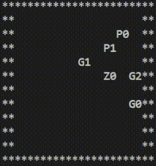

# MarlComs
MarlComs is a multi-agent reinforcement learning explainability project focusing on communication among agents.

## Environment Description:

The environment shown below consists of a number of *runner* agents and a number of *chaser* agents. 
- The agents which are the targets for reinforcement learning are the *runner*s, denoted by 'P#' or 'p#' in the display below. *runner*s have the goal of activating several generators. 
- Generators denoted 'G#', or 'g#', do not move and they must all be activated before *runner*s can exit the game by arriving in the top left square. Generators can be repaired by *runner*s standing on top of them and choosing the repair action (action 4). The repair action takes up a number of turns where the runner will be unable to move.
- One or more *chaser*s, denoted by 'C#' or 'c#' will pursue the *runner*s if they can see them. If they have seen a runner recently, they will move to their last seen location. they can knock out *runner*s by occupying the same square as the *runner*. *chaser*s have their own view range and they will choose to chase the nearest *runner* prefering players earlier in the list. 
- Both *runner*s and *chaser*s keep a memory of the last known location of entities of interest. This memory is reprisented by the lower-case version of that entity when rendered and it will remain in the last seen location of that entity. After several turns, mobile entities (*runner*s and *chaser*s) will dissapear completely as their last known location becomes less and less reliable. 
- *runner*s can call out information to eachother about important entity locations, but *runner* 0's location will also be added to every *chaser*'s internal memory.
- below, one can see an example game being played from *runner* 0's perspective (With chaser denoted Z0) with the initial frame of the video serving to show the entire state of the environment before rendering from the *runner*'s perspective. 


- 

- Rewards will be given to individual *runner*s on the turn that they complete generators or escape, and half of the rewards that each *runner* gained will be added to the other *runner*'s rewards on the last turn of the game.
- the game ends when all of the *runner*s have either been tagged or escaped. 
- Because the *runner*'s view range is only 2 in this example, they do not have enough certain distance between themselves and the *chaser* to fix all three generators without help. 


## Using the environment

Actions for each player are reprisented as a 1-D numpy-array where the argmax is the action taken. The actions are as follows: [up,right,down,left,repair,callout] so two *runner*s actions where one wants to go up and another wants to go left would be

```actions = np.array([[1,0,0,0,0,0,],[0,0,0,1,0,0,]])```

A typical environment initialization and step mimics the structure of the PettingZoo API https://github.com/Farama-Foundation/PettingZoo but the entire API is not implemented and this project has no affiliation with PettingZoo besides using their standardized format for common opperations.

A commented example *EscapeEnvTest.py* of using the environment can be seen below:

```
import EscapeEnv
import numpy as np
import random

env = EscapeEnv.env()
initial_observations = env.reset()
print("Map rendered from omnicient viewpoint:")
env.render_full_ascii()
done = False

while not done:
  actions = np.array([[0,0,0,0,0,],[0,0,0,0,0,]])
  # Player 2 takes a random action. move or communicate
  p2_action = random.randint(0,4)
  actions[1,p2_action] = 1

  # Player 1 takes an action prompted by the terminal
  act = input("Player 0 take action ('w','a','s','d'): ")
  if act == 'w':
    actions[0,0] = 1
  if act == 'd':
    actions[0,1] = 1
  if act == 's':
    actions[0,2] = 1
  if act == 'a':
    actions[0,3] = 1
  if act == 'r':
    actions[0,4] = 1

  # Step the environment and get back the needed information
  observations, rewards, done, truncated, info = env.step(actions)
  
  # during some turns, some of the players are dead and therefore their
  # actions are meaningless. This exposes an array of which players took
  # actions where 1 -> did something and 0 -> dead and did nothing. 
  # On the last turn of the environment, where communal rewards are given,
  # took_actions = np.ones(num_players) so that if this is used to mask
  # rewards, it will still supply rewards for the final step when delayed 
  # rewards are given. To discound the rewards by the proper amount do what
  # you want, but you could keep a sum of 1-took_actions and put gamma^sum_arr
  # to get the properly discounted rewards
  took_actions = env.took_actions
  # Print information of interest
  print(f"rewards: {rewards}, done {done}, truncated {truncated}")
  
  # Render for a human from Player 0's perspective
  env.render_full_ascii(playerid=0)

print("Game is over, be sure to play again")
```

Observations can come in two forms. If `flatten==False`:

`obs1` is a three dimensional array with the following dimensions: `[entity_type, y, x]` where the entity type is either gens, players, *chaser*s, or "my" location. The value at a given entry reprisents the location and information recency of that object where 1 is to actively see the object and 0 is recent information. The rate at which information decays is an environment parameter, `i_decay [0 to 1]`. 

`obs2` is a 1 dimensional array containing [n_players_alive, n_gens_left]

If `flatten==True` then a single dimensional array will be returned with the same values and shape `[map_size[0]*map_size[1]*4 + 2]`

`EscapeEnv` is the environment file and `EscapeEnvTest` is a simple playable implementation from player 0's perspective.

## TODO

the *callout* action is still being developed.  

